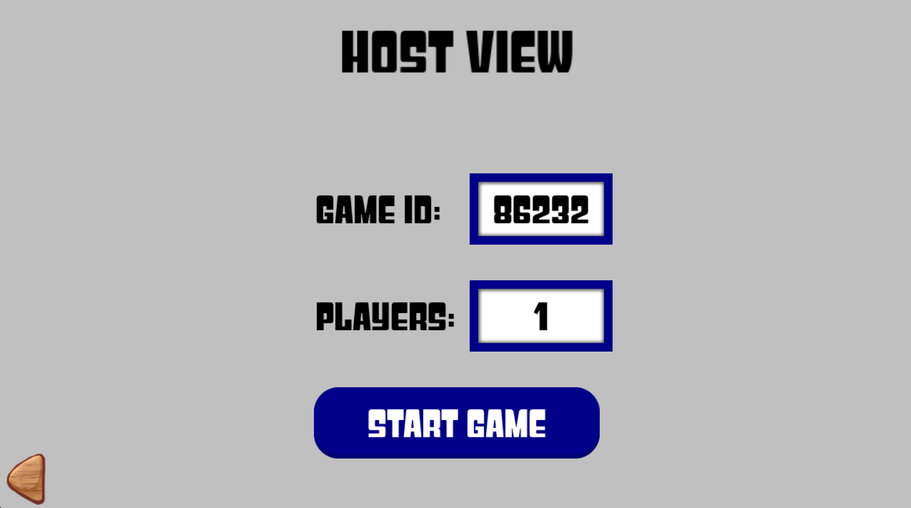
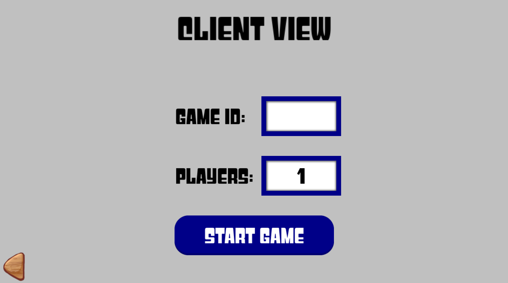
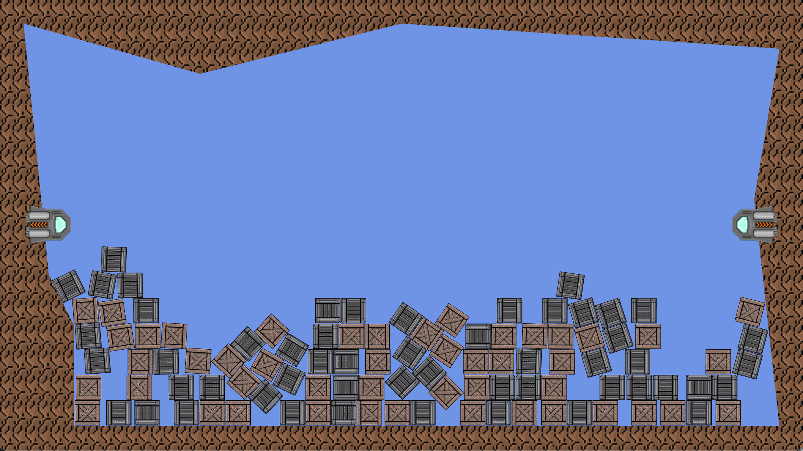

# Networked Physics Tutorial

This tutorial is a variation of the 
[network lab](https://www.cs.cornell.edu/courses/cs5152/2024sp/labs/program3/) 
that many of you have completed. Indeed, there was some discussion about 
replacing that lab with this one. However, in the end, we decided that was too 
much work for you and turned this into an add-on tutorial instead.

But this does mean that you will reproducing a lot of that work in that lab.
We have not completed the host or client scenes, and you will have to write
that code all over again.  With that said, the protocol will be a little 
different this time. That is because you are networking a different kind of
game.

In particular, the purpose of this tutorial is to provide an introduction to 
the networked physics package in CUGL. This package is an abstraction on top 
of the CUGL networking interface that provides automatic synchronization and 
eliminates many problems that might occur in a physically-based multiplayer 
game. That being said, the structure of the netword physics library could be 
helpful for any multiplayer game in general.

#### Table of Contents

- [Application Overview](#application-overview)
- [Networked Physics Library](#networked-physics-library)
- [Instructions](#instructions)

---

### Application Overview

The initial user interface is exactly the same as for the networking lab. To
start up an instance of the game, a player will need to be the host. The
host player should select that option.  They will get a screen with the room
number that they should communicate to the other players.

Note that acquiring this room number requires a connection to a lobby server.
That server is included in `server.json`.  In fact, it is the exact same lobby
server that you used for the network lab!

To join the game, a client types in the room number and presses the
**Start Game** option.

The host should see this connection by an increase in the number of players. 
Once the host believes that everyone has connected, that person should also 
press **Start Game**, which starts the game for everyone. Note that this 
particular application only supports *two players*: the host and a client.

#### The Game

This time the game is a little more complex than pressing color buttons. With 
that said, it is not too complicated. There are two cannons (represented as our
rocket ships for reasons). Each one is controlled by a player over the network.
Each player can use the arrow keys to move the cannon up and down. They can
also hold and release the space key to fire a crate from the cannon at different 
speeds.

---

### Networked Physics Library Overview

The networked physics library revolves around the class `NetEventController`.
This will be the main access point for all networking functionalities, including 
both lobby-making and communications. This class, all related classed can
be found in the folder `cugl/physics2/net`.

You can think of the `NetEventController` class as an extension of the 
`NetcodeConnection` class. It operates on an event-based system, where instead 
of sending raw bytes, all traffics are wrapped as `NetEvent` objects. This 
ensures the type-safety of messages, and allows the separation of built-in 
library communications from user-defined ones.

In this tutorial, you will be instructed to implement the same functionality 
using two different methods, so that you can gain a thorough understanding of 
the capabilities of the physics library with built-in synchronization utilities. 
In particular, we want you to learn how you to tailor this system to your needs 
if necesary.

#### The Start Game Procedure

The network controller functions like an finite state machine that has the 
following states: `IDLE`, `CONNECTING`, `CONNECTED`, `HANDSHAKE`, `READY`, 
`INGAME`, and `NETERROR`. You can get the state of the controller with 
`getStatus()`. A freshly initialized NetEventController instance will start 
off in the `IDLE` state, in this state, the controller is not connected to 
anything.

To start a connection, we need to either host a new lobby, or join an existing 
lobby. This can be done using `connectAsHost()` and `connectAsClient()` 
functions. These two functions prompts the controller to start negotiating for 
a connection, reflected by the `CONNECTING` state. It will then either change 
its state to `CONNECTED` or `NETERROR`. The formers indicates that the 
application has successfully connected to the lobby, while the latter indicates
that the connection failed (likely because either the lobby is down, or there
is a problem with the client's internet connection).

Once the lobby has been created and all players have joined, we need to start 
the game. To prevent the race condition that we mentioned in the networking
lab, the start game procedure in this lab is done through a handshake. When 
`startGame()` is called by the host, the host will lock the lobby preventing 
new players from joining. All players in the lobby will have their controllers 
now in the `HANDSHAKE` state. 

The host will also send a `GameStateEvent` to every player (including itself), 
informing them of their shortUID. The shortUID is a Uint32 used by the package 
to identify the players.  It is a hashed and shortened version of the UUID 
string from `NetcodeConnection`. The physics package uses the shortUID for 
efficiency, but you are free to use whichever for identification purposes.

After initiative the handshake, the host will wait for responses from all 
clients. This allows a "slow client" to catch up so all devices are on a 
similar timeframe. Once players receive their shortUID, they can perform any 
initialization work, and then mark themselves ready for the actual game by 
calling the `markReady()` method. 

When all clients are in the `READY` state, the game will officially start, and 
all clients will go to `INGAME`. This is the official start of the simulation.

---

#### The Physics Synchronization System

One of the most important features of the networked physics package is the 
automatic synchronization of the physics simulation. It will automatically 
package information about objects in the game and send them across client.
It will also automatically process these messages and make adjustments. These 
synchronizations should be entirely hands-off (if setup correctly).

When working with networked physics, we need to use a new box2d world in place
of `ObstacleWorld`. This new class is called `NetWorld`. It is very similar
to `ObstacleWorld`, except that it has additional methods for synchronizing
this box2d world across the network.  To enable shared physics, create a
`NetWorld` and pass it to the `enablePhysics()` method in `NetEventController`.
This prompts the controller to start monitoring a world. It will also 
initialize a `NetPhysicsController` that performs all the physics related 
synchronizations.

Every obstacle in the world has a Uint64 identifier associated with it. This
identifier is **Global**. For an object to be synced, it must have the same 
id across all devices, otherwise the system cannot find it on other clients. 
In general, the higher 32-bits of the object ID is the shortUID of the client 
that first created that object, and the lower 32-bits is an incremented ID. 
This ensures that a race condition where two obstacles have the same ID is 
impossible.

The `NetPhysicsController` class provides an `addSharedObstacle()` function 
for adding objects in-flight. This function figures out the global ID, and 
broadcasts messages to all clients that a new object has been created. Note 
that if you call the `addObstacle()` function directly in `NetWorld`, other 
clients will not necessarily share that obstacle. You have to go through
this controller.

The `addSharedObstacle()` method also relies on the `ObstacleFactory` class.
It is very hard to sync arbitrary obstacles, because we need to send fixture 
informations across. More importantly, if we want objects to show up on the
screen, we also need to stream the texture. Sending all this would be too 
expensive for a live-simulation game. So we only send parameters to an 
`ObstacleFactory`, and the clients can then reproduce the same obstacle with 
the same set of parameters. More details on the `ObstacleFactory` are in the 
instructions section.

Sometimes we also have objects that already existed at the start of a 
simulation, perhaps generated in the `GameScene.init()` method. While we 
could use `addSharedObstacle()`, it would create unnecessary traffic. So for 
a piece of code that is hardcoded to run on all clients, we can use the 
`initObstacle()` method in `NetWorld`. This will generate the same ID for 
obstacles created on different clients, so that the system can then link 
them together. But it will not send any messages over the network.

Another essential part of the synchronization system is **ownership**. The 
client that owns an object will send information about the object to all 
other clients. Normally, the host would be the owner of every object 
automatically. However, there are situations where you might want to give 
object ownership to a client.

#### Important Things To Note

The package intercepts all method calls like `setPosition()`, `setBodyType()`, 
etc. for  obstacles that have `isShared()==true`. It then sends them to 
this information clients. That means calling a method like `setBodyType()` on 
one client also calls it on the other client. If, however, you have a part of 
code that executes on all clients (processing an event that everyone will 
receive), you might not want this feature (as it duplicates unnecessary 
communication). In that case, you should set the obstacles that you are editing 
to be non-shared before the calls and change them back afterwards.

Also, remember that the `addSharedObstacle()` method sends the obstacle to all 
of the connected devices. If both the host and the client call this method, 
then two different objects will be created in the simulation instead of one.

---

### Instructions

Through this assignment you will work on three files:

- `NLHostScene.cpp`
- `NLClientScene.cpp`
- `NLApp.cpp`
- `NLGameScene.cpp`
- `NLCrateEvent.cpp`

You should *not* need to modify the headers. Each of the files above has a 
section marked **student methods**. The methods in this section are either 
empty or incomplete. It is your job to complete them.

#### Task 1: The Host

The first thing to do is to set up the host. There are three methods in the 
**student methods** section.

- `update`, which receives the latest update from the server
- `setActive`, which toggles whether the scene is active
- `startGame`, which prompts the controller to start the game

For the `update` method, you you need to check for the status of `_network` 
(The NetworkController). If its status is `CONNECTED`, you would need to 
update the scene nodes so that `_gameId` displays the id of the room and 
`_player` displays the number of players. 

Additionally, you should check whether the `_startgame` button has been pressed 
and update its text. If it is not pressed yet, then its should display 
"Start Game" and be activated, otherwise, it should be deactivated and show 
"Starting". Remember from the networking lab that changing the text on a button
is somewhat tricky.  That is why we have once again provided the method 
`updateText` for you to use.

For the `setActive` method, you should first check the value.  It it is true, 
you need to activate the `_backout` button, and set the clicked variable to 
false. You need to also call  the network controller to start a connection as 
a host. If the value is false, you should disconnect the network controller, 
and reset all buttons and text fields to their original state.

Finally, the `startGame` method is fairly simple. All you have to do is call 
the network controller to start the game and set the `_startGameClicked` to 
true.

#### Task 2: The Client

It is now time to connect the client. In this case, there are only two methods 
that you have to edit.

- `setActive`, which toggles whether the scene is active
- `init`, which sets up the buttons for the scene

The `setActive` method is very similar to the HostScene counterpart. If value 
is true, you need to activate the `_backout` button, and set the clicked 
variable to false. However, you should start a connection this time. If value 
is false, you should disconnect the network controller, and reset all buttons 
and text fields to their original state.

The client does not connect to the lobby server right away. The player has to 
enter the room number first. Fortunately, we have written the code to process 
the text field and get the room number from the user. And the `connect` method 
is called by the start button (or when you press enter in the text interface). 
But for the `init` method, you need to add to the exit listenser of `_gameId` 
text field so that it calls the network controller to connect as a client.
As with the networking lab, remember to convert the string from decimal to hex.

#### Task 3: The App and Screen Transitions

The next thing to do is to setup the transition logic between these scenes. 
There are three methods that are relevant here:

- `preUpdate`, which is the general update method
- `updateHostScene`, which updates the host scene
- `updateClientScene`, which updates the client scene

Right away, you see that we are using the deterministic loop that we introduced
in the geometry lab. This is because we want to decouple physics from the rest 
of the game loop. Each device runs on different frame rates, and calling physics 
updates with the different deltas will quickly lead to non-determnistic 
behavior. Therefore we have separated the physics update into the `fixedUpdate` 
method, which has a fixed timestep per update, while keeping rendering and 
input at the native framerate of the game.

The `preUpdate` and `updateHostScene` methods are already completed for you. 
You only have to implement the `updateClientScene` method, which is pretty much 
a mirror of `updateHostScene`. The only difference is that everything uses 
`_joingame`, which is the client scene instead of `_hostgame`.

When implementing this method, we need to track if the back button was clicked.
If so, we need to set `_status` back to `MENU`, deactivate `_joingame`, and 
set `_mainmenu` to be active. Otherwise, if the network controller is in 
`HANDSHAKE` state and its has received its shortUID (i.e. `getShortUID()` 
returns a non-zero value), you should initialize the game scene and tell the 
network controller that this client is ready.

If the network controller is in the `INGAME` state, then you'll want to change 
`_status` to `GAME` and set gameplay to active while setting join game to 
inactive. 

Lastly, if the network controller is in `NETERROR`, you should disconnect it.
This includes disposing the game scene if it is initialized, and returning
to the the menu scene as if the back button were pressed.

#### Task 4: The Game

You are almost there. It is now time to set up the actual simulation. There are 
three methods that you'll need to work on:

- `init`, which sets up the scene and adds all objects to the world
- `fireCrate`, which fires a crate from the players cannon

In addition, there are three methods that you need to implement for the 
`CrateFactory` class, which is essential for synchronizing added obstacles:

- `createObstacle`, which generates a pair of obstacle and scene node from the given parameters
- `serializeParams`, which serializes parameters into byte vectors,
- Another `createObstacle`, which takes serialized parameters and generates a pair of obstacle and scene node.

The `init` method is mostly finished. You only have to add a few lines at the 
TODO statement. The first thing is to turn on the physics synchronization. 
This can be done by calling `enablePhysics` on the network controller. You 
have to supply a pointer to the `NetWorld` the simulation is running on.

You may also want to provide an optional function that links obstacles to their 
sceneNodes. TheeT latter allows this physics package to sychronize a scene 
node with an obstacle, so that it can show up directly in the game. If you 
don't supply this, you will either have to link scene node to their obstacles
manually, or use custom events for adding objects. We will show you how to do 
that in a bit.

Once physics is enabled, you can access the physics controller by calling 
`getPhysController()` on the network controller. The next thing you want to do 
is to attach `_crateFact` to the physics controller so that it recognizes 
this factory. Then you will need to give the ownership of the cannon on the 
right (`_cannon2`) to the client using the `acquireObs` function. This is so
that the client has no delays when controlling its own cannon. 

Next up is the `fireCrate` method. For this method you will need to add a new 
crate to the simulation using the `addSharedObstacle()` method from the physics 
controller. Set its velocity in the unit distance at the angle of the cannon, 
scaled by `(50 * _input.getFirePower())`.

Moving on to the `CrateFactory` class, you need to finish the 
`createObstacle(Vec2 pos, float scale)` method. This is fairly straight forward,
 and you can just follow the detailed descriptions in the TODO comment.

For the `serializeParams` method, use `_serializer` to serialize pos and scale.
Remember to make a shared copy of the serializer reference, as otherwise it 
will be lost if the serializer is reset.

Kastly, for the `createObstacle` method that takes in a byte vector, use the 
two methods above, as well as `_deserializer` to complete it.

#### Task 5: Custom Events

Hopefully, you have by now gained a sense of what the physics library can do 
for you. But what if you wanted to do something very complex? Or send some data 
that is unrelated to the physics state? Recall that the network controller is 
based on an event system, you can create custom events for yourself and process 
data however you would like. 

The are only two constraints you must observer. First, the event must subclass 
the `NetEvent` class (i.e. provide a serialize and deserialize method). In
addition it must be registered on the network controller with 
`attachEventType<Your Custom Event>()` method. 

For this part of the tutorial, you will implement a custom event and use it to 
add an extra large crate to the world without the used of `addSharedObstacle()`;
The first part of this task is in the `NLCrateEvent.cpp` file. You will need to 
implement three methods: 

- `allocCrateEvent`
- `serialize`
- `deserialize`

They are very straight forwards and  the details are in the files. 

The next part is to modify the GameScene. First, you will need to attach the 
event in `init`, then you also need to complete the `processCrateEvent` 
function. Fortunately, the majority is written for you; you only have to call 
`addInitObstacle()` to add the allocated obstacle to the world. Finally, 
modify `preUpdate()` so that when BigCrate(the Key 'B') is pressed, you 
allocate and send out that a CrateEvent.

Once you had completed this, you are done with the tutorial.
